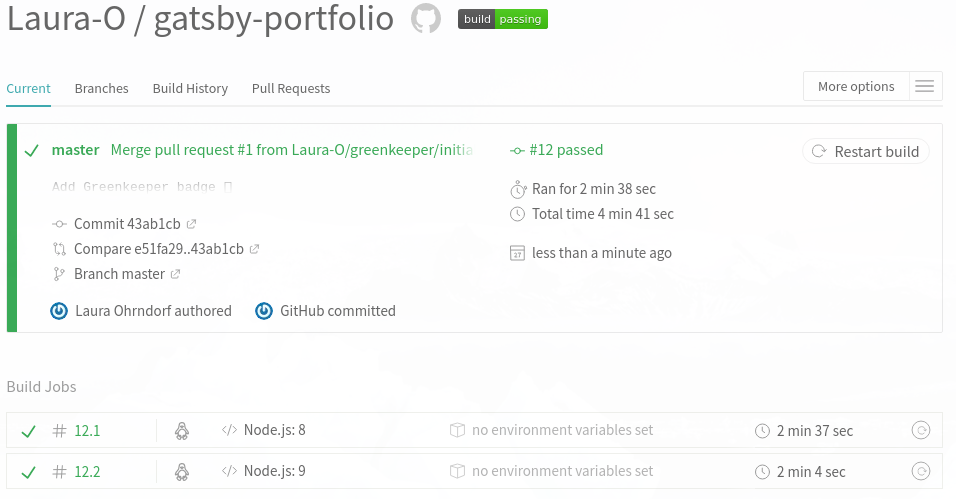
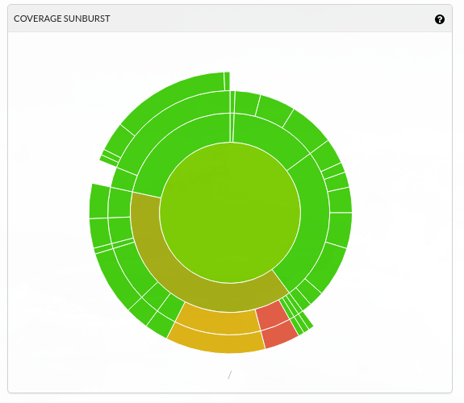
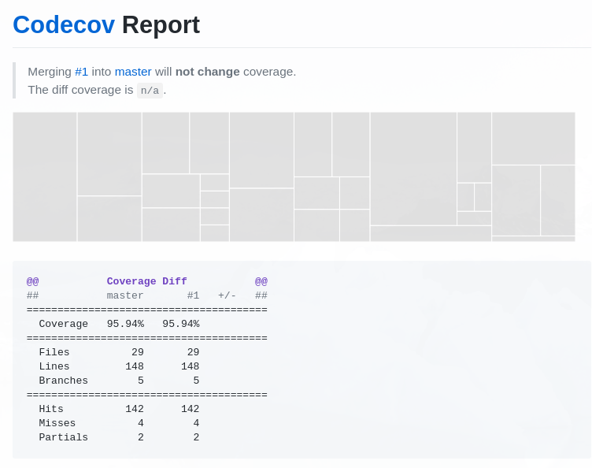

In this article, I will collect topics and approaches related to this website. Your initial reaction might be "That's a static website, who cares?", but I am using this page to try things out and I think I can say that I have already learned a lot. So here we go:

## Progressive Web App

[Progressive Web Apps](https://developers.google.com/web/progressive-web-apps/) (PWAs) are a hot topic. All you need for making a Gatsby page a PWA are these plugins:

* [Gatsby Manifest Plugin](https://www.gatsbyjs.org/packages/gatsby-plugin-manifest/)
* [Gatsby Offline Plugin](https://www.gatsbyjs.org/packages/gatsby-plugin-offline/)

As the names say, the manifest plugin lets you ship a manifest.json and the offline plugin creates a service worker.
This website received a score of 64/100 with [Lighthouse](https://developers.google.com/web/tools/lighthouse/) right after installing the plugins.

## Typography.js

[Typography.js](https://github.com/kyleamathews/typography.js) is a powerful tool for creating typography themes. It basically allows to have a unique design on all pages and being able to make changes without changing hundreds of elements.
It also provides some nice prepared [themes](http://kyleamathews.github.io/typography.js/).

### Installation (using the alton theme)

```bash
npm install typography
npm install typography-theme-alton
```

Add it to gatsby-config.js:

```javascript
{
    resolve: `gatsby-plugin-typography`,
    options: {
    pathToConfigModule: `src/utils/typography`,
    },
},
```

Add _src/utils/typography.js_

```jsx
import Typography from 'typography';
import altonTheme from 'typography-theme-alton';

const typography = new Typography(altonTheme);

export default typography;
```

In case you are adding _typography.js_ to an existing site (i.e. there are already font-related attributes in your css), you should remove all existing rules to see the changes and then start to customize the theme or create your own theme.

## Styled components

After messing around with various SCSS and CSS files, I decided it's time to try the often recommended [styled components](https://www.styled-components.com/). The installation couldn't be easier, it's just one `bash±npm install --save gatsby-plugin-styled-components styled-components babel-plugin-styled-components` and add the plugin to your **gatsby-config.js**. Don't forget the last step, otherwise you will get weird style issues which you are not able to track for hours (believe me!).

I had some issues because I didn't start from scratch but most of the solutions were pretty intuitive. [Here is a cheatsheet](https://jsramblings.com/2017/10/29/migrating-to-styled-components-cheatsheet.html) that explains how to migrate to styled components and doesn't ignore topics like keyframes or conditional classnames.

I think using styled components with Gatsby was a good decision. It took me some time to get used to the approach to _not_ decouple styles and components, but the more I used it, the more did this concept make sense to me.

## Testing

### Jest and Enzyme

Testing with [Jest](https://facebook.github.io/jest/) and [Enzyme](http://airbnb.io/enzyme/) was pretty straightforward. There is not much more to mention than "Install it, use it". :smile:

## Continuous Integration

### Travis

[Travis](https://travis-ci.org/) is probably the best known tool for continuous integration. I can remember my first experiences with Travis when I was learning Ruby on Rails several years ago. tl;dr: I spent hours committing my code again and again to fix all the errors.

I am not sure if Travis is nicer today, it's just because I know more about these things or it's because it's smooth and easy with Gatsby, but that's basically what it was for me.



For reference, you can find my travis.yml [here](https://github.com/Laura-O/gatsby-portfolio/blob/master/.travis.yml).

### Codecov

Braking another butterfly on the wheel, I am also using [codecov](https://codecov.io/gh/Laura-O/gatsby-portfolio) to keep track of the code coverage of my tests. Adding it to an application is easy and comfortable when you have already configured Travis. It's basically done by adding one line to your `package.json`.

Yes, you can also get some nice statistics when running the tests from the commandline. But the images and visualizations which are generated by Codecov are awesome!



Additionally, Codecov also shows the code coverage (and the change of the code coverage) when a pull request is created:



### Greenkeeper

And there is also [Greenkeeper](https://greenkeeper.io/). It observes the dependencies of the application and automatically reates a pull request when they get updated, which saves a lot of time. Pretty neat!

### Sentry

[Sentry](https://www.sentry.io) "provides open source error tracking that shows you every crash in your stack as it happens" (quote from their website). There is a [Gatsby plugin](https://github.com/octalmage/gatsby-plugin-sentry) ~~available which makes using Sentry really easy~~ but it didn't work for me. That's not really a problem as it is super easy to install manually

* Create a Sentry account
* Install Raven `bash±npm install --save raven-js`
* Add this to your index.js:

```javascript
import Raven from 'raven-js';

if (process.env.NODE_ENV === 'production') {
  Raven.config('Your client key (DSN)', {
    environment: 'production',
  }).install();
}
```

And you are ready to go! :smile:
