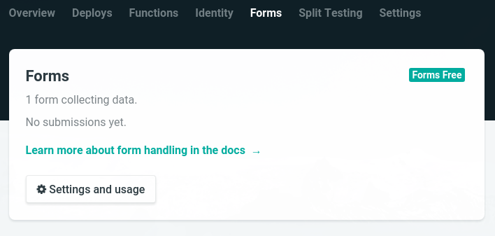
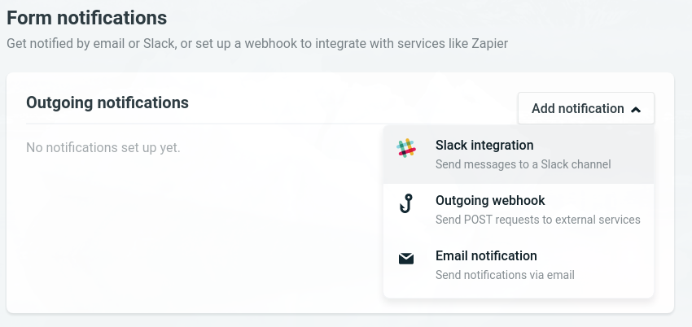
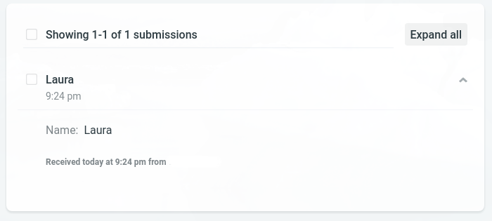
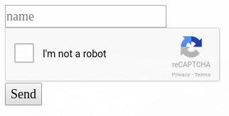
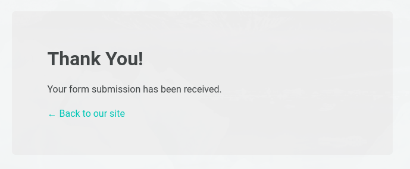

Contact forms and static websites are usually not a well-fitting combination. There are services which help you with that though. One of the easiest ways is using [Netlify](http://www.netlify.com) to host your website and also using their form service. With their free plan, you can receive up to 100 messages and 10 MB per month.

This tutorial is not about how to add your site on GitHub or how to create a Netlify account, so I will just assume that you already have a repository for your website and it is connected to Netlify.

## Adding the form to your page

We start with a minimal example of a form:

```html
<form
    name="contact-form"
    method="post"
    data-netlify="true"
  >
    <input type="text" placeholder="name" name="name"/>
    <button>Send</button>
</form>
```

You have probably noticed that this looks like basic HTML. The only attribute you would not use in a regular form is `javascript±data-netlify="true"`. This is where things get interesting: it lets Netlify know that you want them to manage this form.

## Setting up

After adding this code to a page and committing it to GitHub, Netlify will recognize it and display it in the **Settings > Forms** tab automatically:



You can choose how you want to receive notifications about new submissions in **Settings > Forms > Form notifications**: it can be either Slack notifications, a POST request or via email:



Netlify shows the received form data in a list, including the time the form was submitted and the IP (removed in the screenshot). You can also export the submissions as CSV.



## Spam protection

Netlify gives you two options for spam filtering. As mentioned before, the number of messages is limited in the free plan, so using at least one of them is highly recommended.

### Honeypot field

Using a honeypot is a simple but efficient way to avoid that bots use your forms. It's an excellent solution as you don't have to bother your visitors with stupid arithmetic problems or difficult captchas.

You add an additional input field which you hide using CSS or JavaScript. A spambot would find this input field and fill it out. Your users wouldn't as it is invisible to them. Therefore, all submissions with a filled out honeypot field can be considered as spam and will not be submitted.

To make Netlify aware of this field, you add the attribute `javascript±netlify-honeypot` to the form. The value is the name of the hidden input field:

```html
<form
    name="contact-form"
    method="post"
    data-netlify="true"
    netlify-honeypot="bot-field"
  >
    <input hidden name="bot-field" />
    <input type="text" placeholder="name" name="name"/>
    <button>Send</button>
</form>
```

### reCAPTCHA

Netlify also lets you add a [reCaptcha](https://developers.google.com/recaptcha/). The captcha is verified server-side. If it fails, the user is redirected to the same page and the form data will not be saved.



```html
<form
    name="contact-form"
    method="post"
    data-netlify="true"
    netlify-honeypot="bot-field"
>
    <input hidden className="hidden" name="bot-field" />
    <input type="text" placeholder="name" name="name" />
    <div data-netlify-recaptcha />
    <button>Send</button>
</form>
```

## Success page

Netlify automatically shows a confirmation that the form was submitted successfully if you didn't create a custom page. The design is not too bad and it has a link to go back to your site, so this is not a bad option.



If you want to have your own design, that's not difficult as well: just create one with Gatsby. The easiest way is just adding a page like this `javascript±src/pages/thanks.js`:

```jsx
import React from 'react';
import Link from 'gatsby-link';

const Thanks = () => (
  <div>
    <h1>Thank you!</h1>
  </div>
);

export default Thanks;
```

You can now use the `javascript±action attribute` to forward the user to the page after the form was submitted:

```html
<form
  name="contact-form"
  method="post"
  action="/thanks"
  data-netlify="true"
  netlify-honeypot="bot-field"
>
    <input hidden className="hidden" name="bot-field" />
    <input type="text" placeholder="name" name="name" />
    <div data-netlify-recaptcha />
    <button>Send</button>
</form>
```

### Example code

You can find the example code on [GitHub](https://github.com/Laura-O/gatsby-netlify-form)
